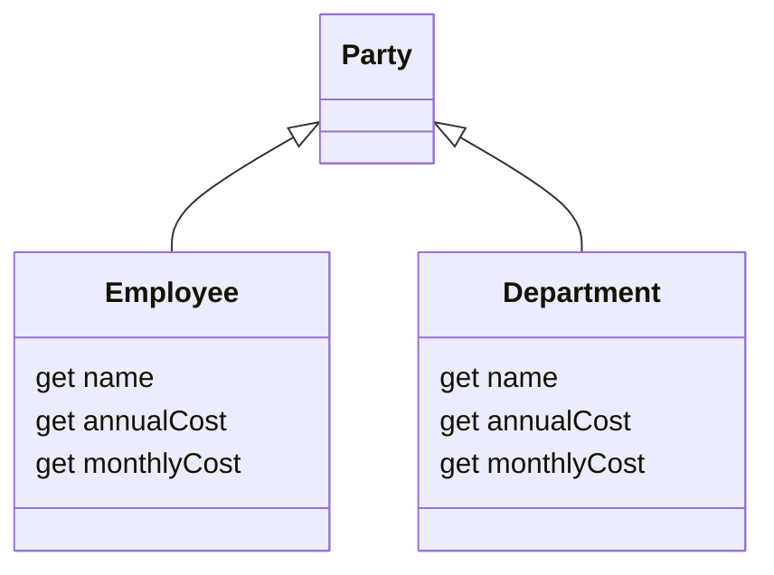
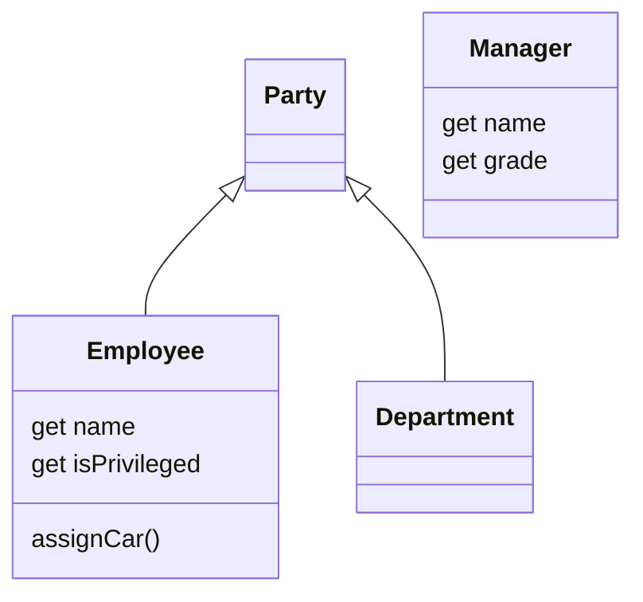

[](https://github.com/kaiosilveira/pull-up-constructor-body-refactoring/actions/workflows/ci.yml)

ℹ️ _This repository is part of my Refactoring catalog based on Fowler's book with the same title. Please see [kaiosilveira/refactoring](https://github.com/kaiosilveira/refactoring) for more details._

---

# Pull Up Constructor Body

<table>
<thead>
<th>Before</th>
<th>After</th>
</thead>
<tbody>
<tr>
<td>

```javascript
class Party { ... }

class Employee extends Party {
  constructor(name, id, monthlyCost) {
    super();
    this._id = id;
    this._name = name;
    this._monthlyCost = monthlyCost;
  }
}
```

</td>

<td>

```javascript
class Party {
  constructor(name) {
    this._name = name;
  }
}

class Employee extends Party {
  constructor(name, id, monthlyCost) {
    super(name);
    this._id = id;
    this._monthlyCost = monthlyCost;
  }
}
```

</td>
</tr>
</tbody>
</table>

Constructors are handy: they're an easy and quick way to abstract initialization logic in a practical, straightforward manner, but they're also tricky: their constraints in terms of execution order, hierarchical dependency, and sync invocation, can sometimes get in our way. This refactoring helps with these ins and outs.

## Working examples

For this refactoring, we have two simple examples, both of them containing organizational class hierarchies, but the second one with a tricky aspect to it.

### Example 1

This working example is a program that contains `Employees` and `Departments`, both of them extensions of `Party`. The hierarchy is represented visually as this:



Our goal is to pull up the portion of construction logic that assigns `name` to each one.

#### Test suite

The test suite covers basic bahavior that's unrelated to this refactoring, but also validates that some fields are set:

```javascript
// Department...
it('should have a name and staff', () => {
  const staff = [new Employee('Kaio', 1, 10), new Employee('Enzo', 2, 10)];
  const department = new Department('Software Engineering', staff);
  expect(department.name).toEqual('Software Engineering');
  expect(department.staff).toEqual(staff);
});

// Employee...
it('should have name, id, and monthly cost', () => {
  const department = new Employee('Kaio', 1, 10);
  expect(department.name).toEqual('Kaio');
  expect(department.id).toEqual(1);
  expect(department.monthlyCost).toEqual(10);
});
```

For the full implementation, please look up the source code.

#### Steps

We start by sliding the assignment to `name` up at `Employee`'s ctor:

```diff
diff --git Employee...
 export class Employee extends Party {
   constructor(name, id, monthlyCost) {
     super();
-    this._id = id;
     this._name = name;
+    this._id = id;
   }
```

then, we add ctor to `Party`:

```diff
diff --git Party...
-export class Party {}
+export class Party {
+  constructor(name) {
+    this._name = name;
+  }
+}
```

With that in place, we can start updating the subclasses. We update `Employee` to delegate the assignment to `name` to the base class:

```diff
diff --git Employee...
 export class Employee extends Party {
   constructor(name, id, monthlyCost) {
-    super();
-    this._name = name;
+    super(name);
     this._id = id;
     this._monthlyCost = monthlyCost;
   }
```

and do the same for `Department`:

```diff
diff --git Department...
 export class Department extends Party {
   constructor(name, staff) {
-    super();
-    this._name = name;
+    super(name);
     this._staff = staff;
   }
```

And that's it!

#### Commit history

Below there's the commit history for the steps detailed above.

| Commit SHA                                                                                                                      | Message                                                               |
| ------------------------------------------------------------------------------------------------------------------------------- | --------------------------------------------------------------------- |
| [47a9243](https://github.com/kaiosilveira/pull-up-constructor-body-refactoring/commit/47a9243d659850b84a07448019fa6c8cb4b36ffd) | ex-1: slide assignment to `name` up at `Employee`'s ctor              |
| [34d98ff](https://github.com/kaiosilveira/pull-up-constructor-body-refactoring/commit/34d98ff27c507025a4282b1b08038fd0ee8d5556) | ex-1: add ctor to `Party`                                             |
| [d6e8d12](https://github.com/kaiosilveira/pull-up-constructor-body-refactoring/commit/d6e8d12131dcd82388d88a56794bd1222ce493c9) | ex-1: delegate `name` assignment to superclass at `Employee`'s ctor   |
| [737b22b](https://github.com/kaiosilveira/pull-up-constructor-body-refactoring/commit/737b22b618cfe11bafa3d32f88935e4906218fe5) | ex-1: delegate `name` assignment to superclass at `Department`'s ctor |

For the full commit history for this project, check the [Commit History tab](https://github.com/kaiosilveira/pull-up-constructor-body-refactoring/commits/main).

### Example 2

This working example is a program that contains a class hierarchy for employees, consisting of a base `Employee` class and a `Manager` subclass. The hierarchy is represented visually as this:



Our goal is to pull up the portion of construction logic that assigns `name` to `Manager`.

#### Test suite

The test suite covers the privileges logic as well as the `name` and `grade` values of `Manager`:

```javascript
describe('Manager', () => {
  it('should have a name and grade', () => {
    const manager = new Manager('Kaio', 5);
    expect(manager.name).toEqual('Kaio');
    expect(manager.grade).toEqual(5);
  });
});
```

That's the minimum we need in place to get going.

#### Steps

We start by extracting a function on the privileges logic at `Manager`'s constructor:

```diff
diff --git Manager...
export class Manager extends Employee {
   constructor(name, grade) {
     super(name);
     this._grade = grade;
-    if (this.isPrivileged) this.assignCar();
+    this.finishConstruction();
   }
+
+  finishConstruction() {
+    if (this.isPrivileged) this.assignCar();
+  }
 }
```

then, we pull `finishConstruction` up to `Employee` baseclass:

```diff
diff --git Employee...
export class Employee {
     this._name = name;
   }
+  finishConstruction() {
+    if (this.isPrivileged) this.assignCar();
+  }
+

diff --git Manager...
export class Manager extends Employee {
   get isPrivileged() {
     return this._grade > 4;
   }
-
-  finishConstruction() {
-    if (this.isPrivileged) this.assignCar();
-  }
 }
```

And that's it!

#### Commit history

Below there's the commit history for the steps detailed above.

| Commit SHA                                                                                                                      | Message                                                 |
| ------------------------------------------------------------------------------------------------------------------------------- | ------------------------------------------------------- |
| [4fb1b74](https://github.com/kaiosilveira/pull-up-constructor-body-refactoring/commit/4fb1b74439d9fa76a101926082e07ea26fd3abad) | extract function on privilege logic at `Manager`'s ctor |
| [d0c38b0](https://github.com/kaiosilveira/pull-up-constructor-body-refactoring/commit/d0c38b0d93123ec1b61b360d14710cb0fdd13852) | pull `finishConstruction` up to `Employee` baseclass    |

For the full commit history for this project, check the [Commit History tab](https://github.com/kaiosilveira/pull-up-constructor-body-refactoring/commits/main).
